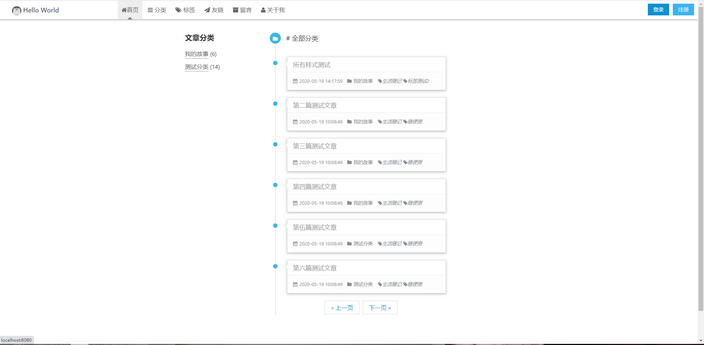

# wzz_blog

一个小小的个人博客系统

但是功能俱全的博客系统~!

## 项目代码

- [码云]()
- [GitHub]()

## 技术栈

> 1. SpringBoot
> 2. Html
> 3. CSS
> 4. JavaScript
> 5. JQuery
> 6. AmazeUI
> 7. Thymeleaf
> 8. druid数据源
> 9. Maven构建工具
> 10. Mybatis持久层
> 11. Mysql数据库

## 功能

- 登录模块,注册模块, 
- 文章详情, 文章分类详情, 文章标签详情
- 友链详情
- 富文本写文章模块, 管理系统注册过的用户, 用户密码找回功能
- 文章管理模块, 用户留言管理,友情链接管理, 个人独特信息修改
- 文章楼中楼评论管理

## 数据库说明

1. 数据库名为blog，如需更改，更改application.yml中的配置文件即可
2. 数据库的sql文件，已上传至sql文件夹中

3. 数据库字段详解

**PS: 本博客系统设置的超级管理员只存在一个，roleId为2 即是本系统的博主，如若数据库出现roleId为2的不止一位用户，优先选取第一位作为超级管理员用户（也就是博主）**

## 快速启动

1. 配置开发环境：
    * [MySQL](https://dev.mysql.com/downloads/mysql/)
    * [JDK1.8或以上](http://www.oracle.com/technetwork/java/javase/overview/index.html)
    * [Maven](https://maven.apache.org/download.cgi)
2. 数据库依次导入sql下的数据库文件
    * blog.sql
    * sql字段详解
3. 使用IDEA开发工具打开此项目,  等待maven解决依赖问题, 启动项目即可

此时，浏览器打开，输入网址`http://localhost:8080, 此时进入博客首页~

##  推荐

[高仿网易云音乐](https://gitee.com/wzhouzhou/vue_wzz_cloudMusic)

## 项目整体预览

### 首页

### 文章分类

### 标签分类

### 登录功能

### 注册及找回密码

### 后台

### 创作文章

## 问题

- 开发学习问题或者好的建议可以给出反馈交流, 一起学习
- 如果有需要QQ群里提问，请在提问前先完成以下过程：
    - 请仔细阅读本项目文档，查看能否解决；
    - 百度或谷歌相关技术；
    - 查看相关技术的官方文档
    - 请提问前尽可能做一些思考分析，然后提问时给出详细的信息以及个人对问题的理解。

希望能与大家成为开发路上的好朋友~! 期待与你相遇~

## 致谢

本项目基于或参考以下项目：

1. 前台样式模仿 @张海洋Blog

2. 后台样式借鉴 @鲢鱼Blog系统

项目历时: 10天

## License

Copyright (c) 2020-person wangzhouzhou